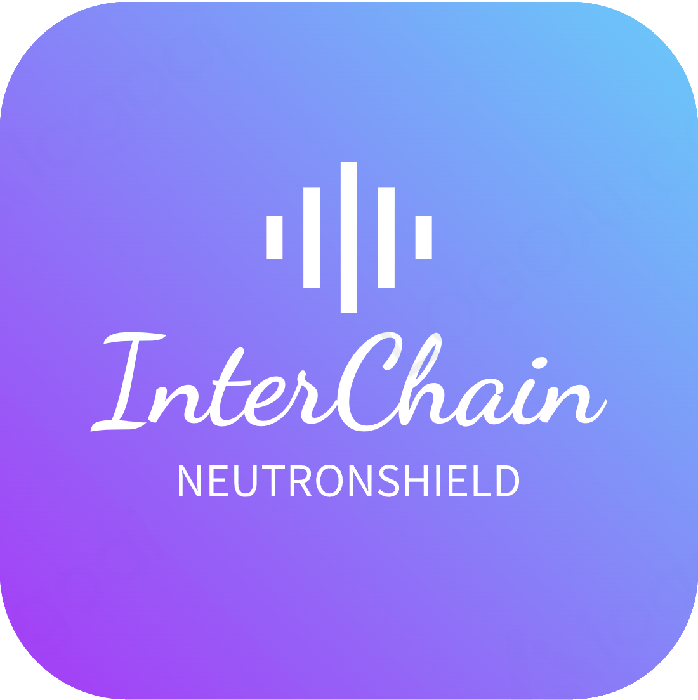

# NeutronShield :shield:

### InterChain DeFi Liquidation Manager

[](https://hackwasm.com)
[](https://github.com/gorgos/NeutronShield/actions)
[](https://github.com/gorgos/NeutronShield/issues)
[](https://github.com/gorgos/NeutronShield/stargazers)
[](https://github.com/gorgos/NeutronShield/blob/main/LICENSE)

---

<p align="center">
  
</p>

**NeutronShield** is an InterChain DeFi Liquidation Manager designed to protect your perp positions from liquidation. This project was developed during the HackWasm 2023 hackathon in Berlin.

NeutronShield utilizes cron and interchain functions from Neutron and queries the Injective chain to monitor if a user's perp position is close to liquidation. If it is, NeutronShield smartly adds more margin into the position.

Best of all? The funds never leave the user's account on Injective. The user only provides permissions to the InterChainAccount via authz.

## 🚀 Features

- Monitors user's perp positions on the [Injective](https://injective.com/) chain.
- Adds more margin to the position if it's close to liquidation.
- Maintains the security of user's funds – they never leave the Injective account.
- Efficient utilization of cron and interchain functions from [Neutron](https://neutron.org/).

## ⚙️ Installation

You can clone the repository and install the dependencies by running the following commands:

```bash
git clone https://github.com/gorgos/NeutronShield.git
cd NeutronShield
npm install
cargo install -f beaker # `-f` flag for up-to-date version
beaker wasm build
```

## 🎥 Demo

You can find a demo video here: [https://youtu.be/Ehx3LWxnCJ0](https://youtu.be/Ehx3LWxnCJ0).

## 📚 License

This project is licensed under the MIT License - see the LICENSE file for details.

## 💬 Support

If you find any bugs or have a feature request, please open an issue on Github!.

## 🏆 Acknowledgements

Big thanks to the HackWasm 2023 team for organizing the hackathon where NeutronShield was born. Shoutout to the Neutron team for their support in integrating their functions.
